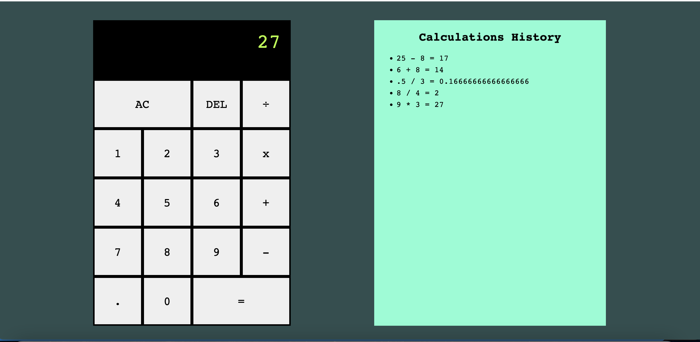
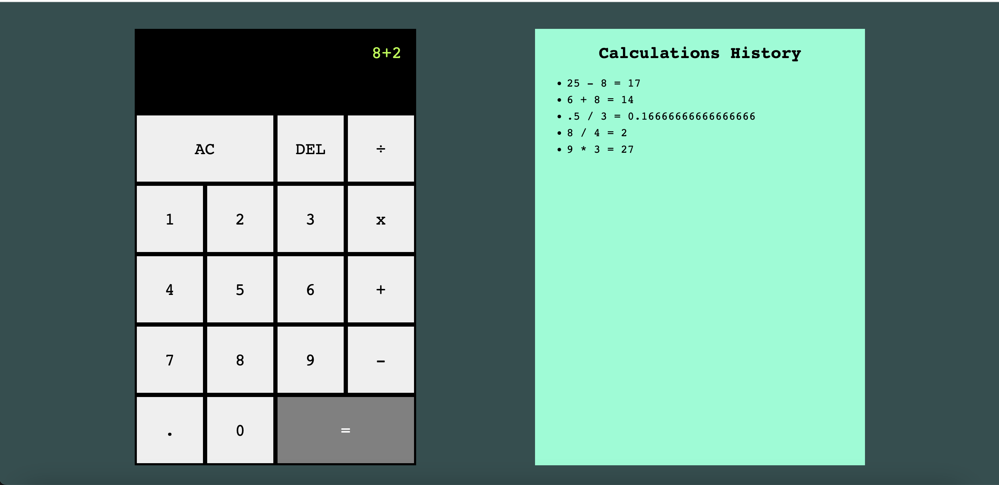

# Server Side Calculator

## Description

_Tier 2/Week8_

I was tasked with creating a calculator that used the server side to run all calculations.  The client side collects the user's input and sends the data (POST request) in an object to the server.  The client.js file then sends a GET request to receive the calculations back from the sever.  Using JQuery, I display the calculations on the DOM.  My personal goal for this project was to use CSS grid to create not only the calculator but the entire layout for the page. The extra time spent on design led to the creation of an interface that was both aesthically pleasing and intuitive for users based on one's real world experience of using a calculator.  

To see my repository, please visit: [GitHub Repository](https://github.com/sam-c-freeman/weekend-jquery-server-calculator)

## Screen Shots

## Usage
Features:

1. Can enter two term calculations
2. App calculates +,-,* or / and displays answer on the DOM
3. Can delete single characters when mistakes are made
4. Can clear the entire screen using the AC button

## Built With

* HTML
* CSS
* Javascript
* JQuery
* Client and server side JS files

## Acknowledgement
Thanks to [Prime Digital Academy](www.primeacademy.io) who equipped and helped me to make this application a reality. 

## Support
If you have suggestions or issues, please email me at: <samcfreeman888@gmail.com>